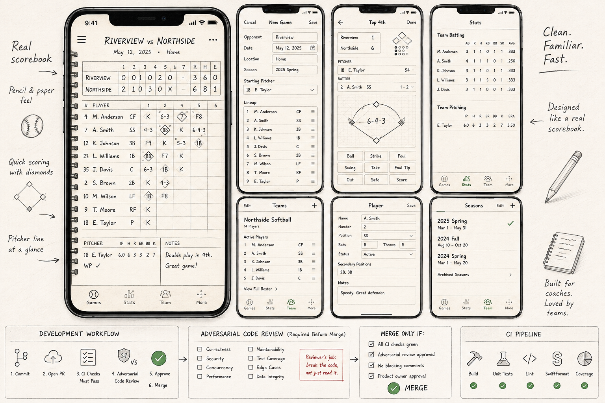
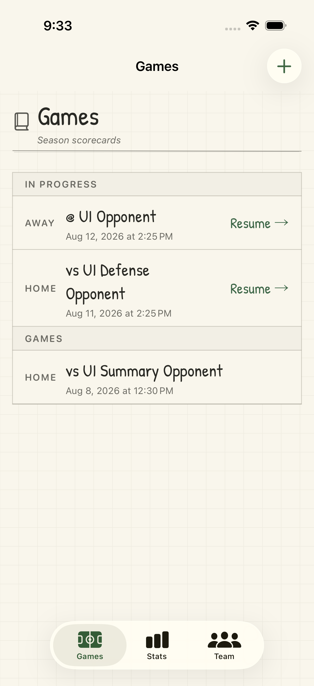
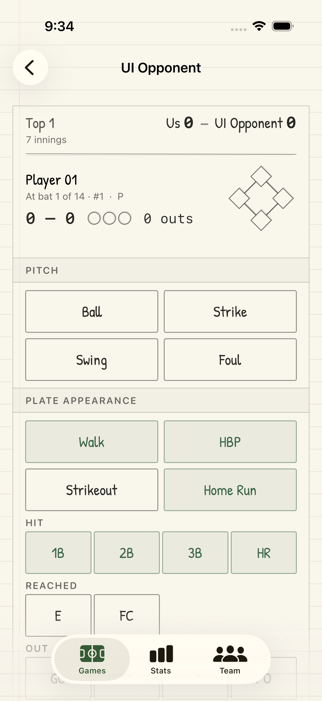
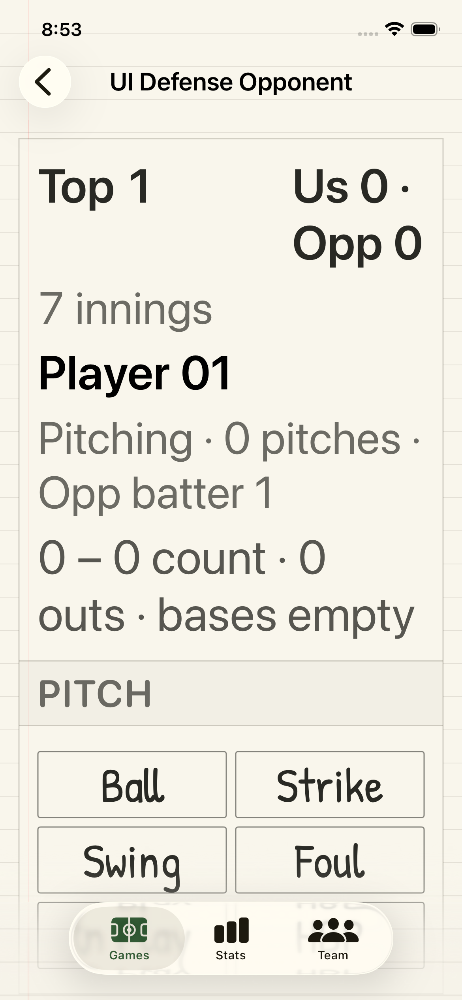
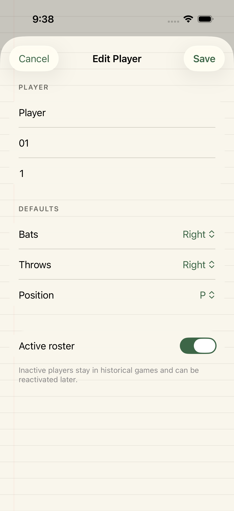

# Slice 5.5 evidence and approval

Ticket: [#10 — Slice 5.5 visual evidence, device-size coverage, and approval](https://github.com/psevers/softball-scoring/issues/10)

Status: **Approved by the product owner on August 12, 2026**

## Capture contract

- Captured August 12, 2026 from baseline `22b5c2e` plus the ticket 10 working tree.
- Review base: `cda3da4` (the parent before the Slice 5.5 foundation work).
- Xcode 26.6 (`17F113`), XcodeGen 2.46.0, iOS 26.5.
- Devices: iPhone 17 (`FB739517-7F6A-4309-A112-B50143709CA5`) and iPhone 17e (`8D51D517-AA1B-40EF-9519-AED1F963EA4E`).
- Portrait, full-screen, deterministic `-uiTesting` fixtures.
- Standard runs add `-UIPreferredContentSizeCategoryName UICTContentSizeCategoryL`; Accessibility runs use `UICTContentSizeCategoryAccessibilityXL`. This prevents ambient simulator text settings from changing the labeled configuration.
- The four primary runs use light system appearance. The representative dark-system run proves the app intentionally retains its light scorebook-paper presentation.
- Each evidence directory contains the exported PNGs and the raw Xcode result attachment manifest.

## Device and text-size matrix

| Device | Standard | Accessibility XL |
| --- | --- | --- |
| iPhone 17 | [13 core frames](final/iphone-17/standard-large-light/) · [batting line](final/iphone-17/standard-large-light-batting-line/) | [13 core frames](final/iphone-17/accessibility-xl-light/) · [batting line](final/iphone-17/accessibility-xl-light-batting-line-corrected/) |
| iPhone 17e | [13 core frames](final/iphone-17e/standard-large-light/) · [batting line](final/iphone-17e/standard-large-light-batting-line/) | [13 core frames](final/iphone-17e/accessibility-xl-light/) · [batting line](final/iphone-17e/accessibility-xl-light-batting-line-corrected/) |

Representative system-dark proof: [iPhone 17, standard text](final/iphone-17/standard-large-dark-system/).

The 13 core frames in every primary directory are: Games home, new-game setup, lineup construction, live offense, live defense, offensive runner confirmation, defensive runner confirmation, team/roster, player editor, season list, season editor, game summary, and Stats empty state. The supplemental batting-line run captures the top and bottom of the full stat grid and asserts that all 13 columns are reachable and that values align within each visual row.

## Reference comparison

| Approved visual direction | Representative implementation |
| --- | --- |
|  |  |
|  |  |
|  |  |
|  |  |

The implementation carries the approved scorebook character through the warm paper field, red margin and ruled lines, graphite/green ink palette, hand-marked action type, ledger geometry, rounded translucent navigation, and restrained status color. It adapts those motifs to live scoring and administration instead of treating the reference as a literal fixed-size mockup.

## Visual review findings

- Critical game and player state remains readable in the small-device and Accessibility XL runs.
- Essential scoring and save/start actions remain reachable by scrolling; the UI tests exercise those paths rather than relying on screenshot inspection alone.
- Selected, positive, destructive, and disabled states use text, borders, icons, or structure in addition to color.
- Tabular stat values remain aligned. The evidence pass caught an Accessibility XL row-baseline defect; the stat grid now scales its minimum column width with Dynamic Type, and the regression test checks visual-row value alignment.
- System-dark mode still renders the intended light paper surface and retains readable metadata and controls.
- Outdoor-like bright-display contrast received a separate manual stress inspection. A 25% white glare veil was applied to representative Games home, live offense, iPhone 17e Accessibility XL live defense, and dark-system player-editor captures. Primary game/player state, scores/counts, action labels and borders, field labels, navigation, and selected-toggle state remained legible; faint graph-paper texture appropriately receded without carrying essential meaning. The diagnostic transforms were temporary and are not canonical approval captures.

## Approval gate

Product owner: Patrick Severs

Decision: approved — "approved. this is good"

Approval date: August 12, 2026

The product owner approved the whole evidence set before the final two-axis code review, permanent documentation update, and ticket commit.

## Final review and verification

- Correctness/security and maintainability/scope reviews examined the complete change set from review base `cda3da4`.
- Review findings led to atomic evidence export, strict attachment-name validation, explicit standard Dynamic Type pinning and recapture, consolidated metadata, and the documented bright-display stress inspection.
- Both final re-reviews reported no remaining P0, P1, or P2 findings.
- The post-review complete Xcode scheme passed on iPhone 17 / iOS 26.5: 116 tests (119 parameterized test cases), with zero failures or skips.

## Reproduction

The primary evidence tests are:

- `ScrollReachabilityUITests/testSliceFiveFiveStandardEvidenceSurfacesRemainReachable`
- `ScrollReachabilityUITests/testSliceFiveFiveAccessibilityEvidenceSurfacesRemainReachable`
- `ScrollReachabilityUITests/testSliceFiveFiveStandardBattingLineRemainsAligned`
- `ScrollReachabilityUITests/testSliceFiveFiveAccessibilityBattingLineRemainsAligned`

Use [`scripts/export-slice5-5-evidence.zsh`](../../../scripts/export-slice5-5-evidence.zsh) with a newly generated `.xcresult` bundle and a new output directory. The script refuses to overwrite existing evidence.
